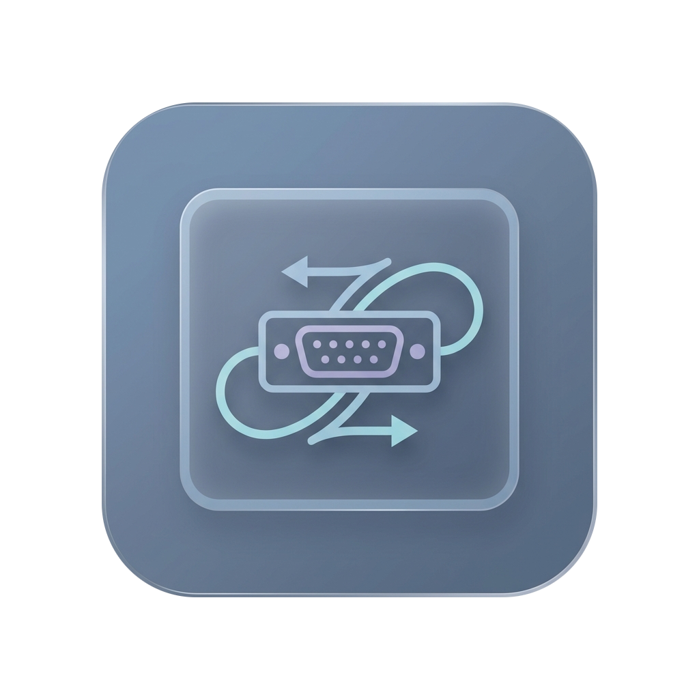
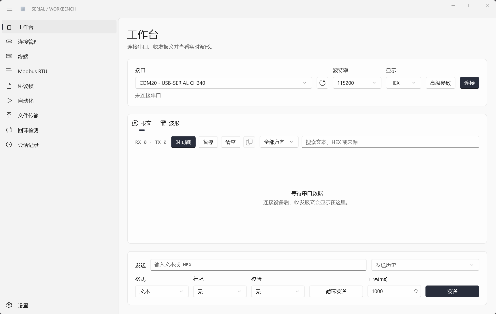
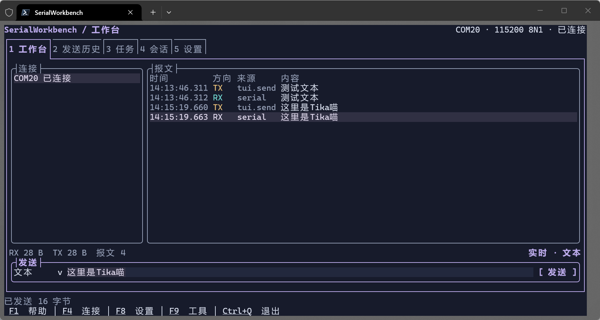
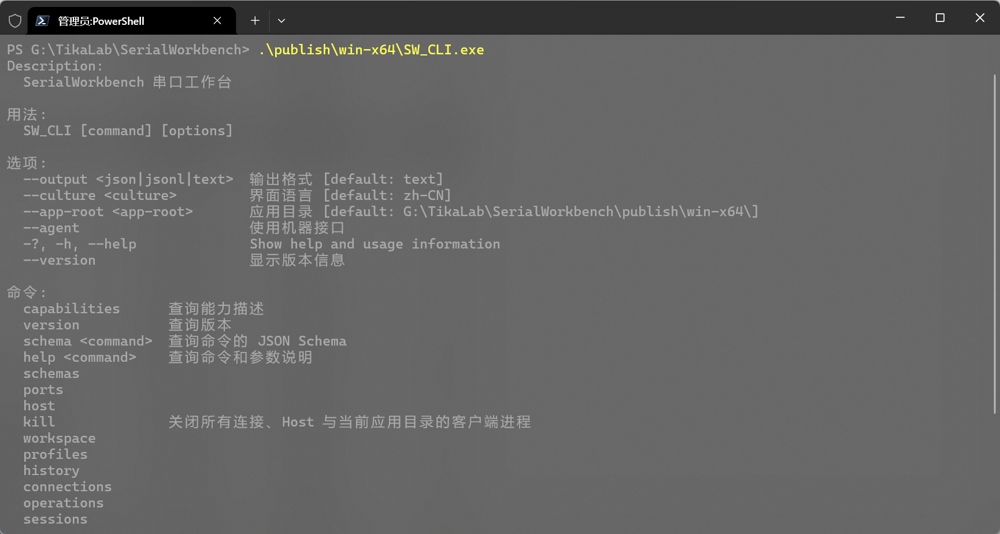

  

  <h1>SerialWorkbench</h1>

  
面向 Windows 11 的串口调试、协议分析、数据采集与设备交互工作台。

  

    <a href="#快速开始">快速开始</a>
    ·
    <a href="#使用方式">使用方式</a>
    ·
    <a href="docs/architecture.md">系统架构</a>
    ·
    <a href="docs/release.md">发布说明</a>
  

  
  
  

  
目录

  <ol>
    <li><a href="#项目简介">项目简介</a></li>
    <li><a href="#界面预览">界面预览</a></li>
    <li><a href="#功能范围">功能范围</a></li>
    <li><a href="#技术栈">技术栈</a></li>
    <li><a href="#快速开始">快速开始</a></li>
    <li><a href="#使用方式">使用方式</a></li>
    <li><a href="#自动发布">自动发布</a></li>
    <li><a href="#数据目录">数据目录</a></li>
    <li><a href="#文档">文档</a></li>
    <li><a href="#参与开发">参与开发</a></li>
    <li><a href="#许可证">许可证</a></li>
  </ol>

## 项目简介

SerialWorkbench 将 WinUI 3 图形工作台、Terminal.Gui 终端工作台和命令行接口接入同一个 Host。串口连接、会话、任务、协议事务和事件日志由 Host 统一管理，各客户端只负责不同的交互方式。

~~~text
SW.exe       WinUI 3 图形工作台
SW_TUI.exe   Terminal.Gui 终端工作台
SW_CLI.exe   CLI 与 Agent 机器接口
SW_HOST.exe  串口、任务、会话和 RPC 服务
~~~

~~~text
WinUI / TUI / CLI / Agent
          │
          ▼
    Windows named pipe
    StreamJsonRpc
          │
          ▼
    SerialWorkbench.Host
          ├─ Windows SerialPort
          ├─ 原始事件与会话
          └─ SQLite 存储
~~~

GUI 承载完整的人机操作，TUI 聚焦连接、收发和日志等高频流程，CLI 覆盖可程序化调用的业务能力。Agent 通过 `SW_CLI.exe --agent` 使用同一套 CLI 命令树，只切换到稳定的 JSON/JSONL 输出。

## 界面预览

  

  

  

## 功能范围

| 领域 | 能力 |
| --- | --- |
| 串口 | 端口枚举、设备身份、波特率、校验、停止位、流控、DTR/RTS、BREAK、RS-485 |
| 收发 | 文本与 HEX、编码、行尾、校验追加、循环发送、RX/TX 监视、来源筛选 |
| 连接 | 多连接、共享 `connectionId`、按设备身份重连、连接分段、写入租约 |
| 协议 | Modbus RTU、通用 JSON 协议模板、帧长度、字段、大小端、校验 |
| 任务 | 自动化序列、回环、Modbus 扫描与轮询、XMODEM-CRC、后台任务 |
| 会话 | SQLite 会话、原始事件、筛选、CSV/JSONL/TXT/HEX/binary 导出、回放 |
| 分析 | 文本分行、HEX 聚合、波形解析、报文单选与多选复制 |

原始串口字节先进入事件和会话，再派生为文本、HEX、波形或协议结果。一次串口读取得到的数据块不等于协议帧。

## 技术栈

- [.NET 10](https://dotnet.microsoft.com/)
- [WinUI 3](https://learn.microsoft.com/windows/apps/winui/winui3/)
- [Windows App SDK](https://learn.microsoft.com/windows/apps/windows-app-sdk/)
- [Terminal.Gui](https://github.com/gui-cs/Terminal.Gui)
- [System.CommandLine](https://github.com/dotnet/command-line-api)
- [Spectre.Console](https://spectreconsole.net/)
- [StreamJsonRpc](https://github.com/microsoft/vs-streamjsonrpc)
- [SQLite](https://www.sqlite.org/)

## 快速开始

### 环境要求

- Windows 11 x64
- .NET SDK 10.0.400
- Windows SDK 10.0.26100.0
- Windows App SDK 2.4.0

### 从源码构建

~~~powershell
git clone https://github.com/RE-TikaRa/SerialWorkbench.git
Set-Location SerialWorkbench
.\eng\test.ps1
~~~

`eng/test.ps1` 会按仓库流程格式化、构建并运行测试。硬件串口测试仅在设置 `SERIALWORKBENCH_TEST_PORT` 时运行。

### 生成本地便携版

生成包含 GUI、TUI、CLI 和 Host 的完整目录：

~~~powershell
.\eng\publish.ps1
~~~

生成两种可上传的压缩包和 SHA256 校验文件：

~~~powershell
.\eng\release.ps1 -Version v1.0.0
~~~

产物位于 `artifacts/release/`。完整发布目录位于 `publish/win-x64/`。

## 使用方式

### GUI

~~~powershell
.\publish\win-x64\SW.exe
~~~

GUI 提供完整的连接、报文、发送、历史、过滤、波形、Modbus、会话和 XMODEM 工作区。

### TUI

~~~powershell
.\publish\win-x64\SW_TUI.exe
~~~

TUI 只使用 Terminal.Gui 原生控件，主工作区围绕连接、报文、发送和状态展开。

| 按键 | 操作 |
| --- | --- |
| `Alt+1` 至 `Alt+5` | 工作台、发送历史、任务、会话、设置 |
| `F1` | 帮助 |
| `F2` | 暂停或继续显示 |
| `F3` | 清空报文 |
| `F4` | 连接管理 |
| `F5` | 刷新端口 |
| `F6` | 复制所选报文 |
| `F7` | 返回实时视图 |
| `F8` | 设置 |
| `F9` | 工具 |
| `Ctrl+Q` | 退出 |

HEX 输入每两个十六进制数字表示一个字节：

~~~text
0A
01 03 00 00 00 01
0x01, 02-0A:FF
~~~

### CLI

~~~powershell
.\publish\win-x64\SW_CLI.exe --help
.\publish\win-x64\SW_CLI.exe ports list --output json
.\publish\win-x64\SW_CLI.exe connections open --port COM20 --baud 115200 --output json
.\publish\win-x64\SW_CLI.exe send --port COM20 --baud 115200 --hex "01 03 00 00 00 01" --output json
.\publish\win-x64\SW_CLI.exe monitor --port COM20 --baud 115200 --seconds 10 --output jsonl
.\publish\win-x64\SW_CLI.exe protocol inspect --hex "01 03 02 00 0A 38 43" --output json
~~~

CLI 使用 System.CommandLine 管理命令、参数、Help、补全和 Response File。文本结果使用 Spectre.Console，`--output json` 和 `--output jsonl` 提供机器可读结果。

### Agent

Agent 不使用 TUI，也不解析终端画面。它通过 CLI 的完整命令树工作，只把输出切换为稳定的 Schema v2：

~~~powershell
.\publish\win-x64\SW_CLI.exe --agent capabilities
.\publish\win-x64\SW_CLI.exe --agent schema modbus.read
.\publish\win-x64\SW_CLI.exe --agent ports list
.\publish\win-x64\SW_CLI.exe --agent modbus read --port COM20 --baud 115200 --slave 1 --address 0 --quantity 1 --function 3
.\publish\win-x64\SW_CLI.exe --agent sessions export --id SESSION_ID --file E:\Exports\session.jsonl --format jsonl
~~~

输出信封包含固定的 `schemaVersion`、`command`、`type`、`status`、`result` 和 `error` 字段。契约记录写入 stdout，诊断信息写入 stderr；JSONL 每行一条记录。

关闭当前应用目录中的客户端、连接和 Host：

~~~powershell
.\publish\win-x64\SW_CLI.exe --agent kill
~~~

`kill` 只识别同一应用目录中的 `SW.exe`、`SW_TUI.exe`、`SW_CLI.exe` 和 `SW_HOST.exe`。

## 自动发布

推送 `v*` 格式的 Git tag 后，GitHub Actions 会运行完整测试并创建 Release：

~~~powershell
git tag v1.0.0
git push origin v1.0.0
~~~

每个 Release 提供两种 Windows x64 自包含便携包：

| 文件 | 内容 |
| --- | --- |
| `SerialWorkbench-vX.Y.Z-win-x64-lite.zip` | CLI、TUI、Host、Schema、说明和许可证 |
| `SerialWorkbench-vX.Y.Z-win-x64-full.zip` | 轻量包全部内容，以及 GUI、WinUI 资源和 Windows App SDK 文件 |

详细规则见 [发布说明](docs/release.md)。

## 数据目录

Host 使用入口程序所在目录的 `data/` 保存全局设置、日志、任务和会话：

~~~text
data/
├─ settings/
│  ├─ serial-preferences.json
│  ├─ serial-profiles.json
│  ├─ send-history.json
│  └─ workspace.json
├─ sessions/
│  └─ *.swbsession
├─ logs/
└─ operations.sqlite3
~~~

选择工作区后，新会话写入工作区的 `sessions/`，应用级设置仍保存在应用目录的 `data/settings/`。

## 文档

- [系统架构](docs/architecture.md)：进程、Host、RPC、数据和构建边界
- [产品模型](docs/design.md)：连接、会话、协议、界面和 CLI 语义
- [功能范围与增强方向](docs/feature-gap-analysis.md)：当前能力和验证边界
- [发布说明](docs/release.md)：GitHub Release、双包规则和校验文件
- [代码规范](docs/code-style.md)：分层、异步、测试、文档和提交约定
- [JSON Schema](schemas/)：CLI 与 Agent 的机器契约

## 参与开发

提交改动前运行完整检查：

~~~powershell
.\eng\test.ps1
~~~

改动应保持 Host、RPC、客户端和文档之间的契约一致。涉及硬件的测试请先重新枚举当前串口设备。

## 许可证

Apache License 2.0，见 [LICENSE](LICENSE)。

<a href="#readme-top">返回顶部</a>

